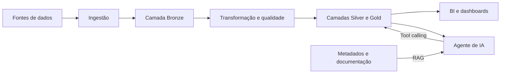

# Data Engineering Lab

Projeto de aprendizado e experimentação com tecnologias de engenharia, análise e consumo de dados.

O objetivo é construir uma plataforma de dados de ponta a ponta, explorando diferentes ferramentas e arquiteturas: da ingestão e transformação até a visualização em BI e o consumo por agentes de inteligência artificial.

O projeto também está sendo estruturado com o apoio de inteligência artificial, utilizada para acelerar o processo de aprendizado, auxiliar na pesquisa de tecnologias e apoiar o planejamento, a implementação e a documentação das soluções.

> Este repositório está em desenvolvimento. Tecnologias, arquitetura e escopo poderão evoluir conforme novos estudos e experimentos forem realizados.

## Objetivos

- Praticar ingestão, modelagem, transformação e qualidade de dados.
- Comparar tecnologias e abordagens utilizadas em plataformas modernas de dados.
- Construir modelos analíticos prontos para consumo.
- Disponibilizar indicadores por meio de uma ferramenta de BI.
- Criar uma interface conversacional para consultar e interpretar os dados.
- Manter implementações reproduzíveis, testáveis e versionadas.

## Arquitetura planejada



O agente de IA combinará duas estratégias:

- **RAG:** recuperação de contexto semântico, como definições de métricas, regras de negócio, documentação e catálogo de dados.
- **Tool calling:** execução controlada de consultas e ferramentas para responder a perguntas sobre dados específicos.

## Tecnologias

### Em uso

- **Snowflake:** armazenamento e processamento analítico.
- **dbt:** transformação, modelagem, testes e documentação dos dados.
- **Python + dlt:** extração e carga de dados.
- **Dagster:** orquestração do pipeline diário (Bronze → Silver → Gold) via Docker Compose.

### Planejadas para experimentação

- **Databricks**
- **AWS Redshift**
- **AWS Glue**
- **Ferramenta de BI:** a ser definida.
- **Agente de IA com RAG e tool calling**

Outras tecnologias poderão ser adicionadas à medida que o laboratório evoluir.

## Escopo atual

O primeiro cenário do laboratório utiliza dados de e-commerce:

1. Uma pipeline Python com `dlt` carrega os dados no Snowflake.
2. A camada **Bronze** preserva os dados ingeridos.
3. O `dbt` transforma e testa os dados nas camadas **Silver** e **Gold**.
4. O **Dagster** orquestra extract/transform (Compose + UI em `http://localhost:3000`); veja `dw/snowflake/RUNBOOK.md`.
5. A camada Gold será a base para indicadores, dashboards e consultas do agente de IA.

## Estrutura do repositório

```text
data-engineering-lab/
├── pipelines/
│   └── ecommerce_bronze/     # Pipeline de ingestão com Python e dlt
├── orchestration/
│   └── dagster/              # Dagster OSS (Compose, code location, assets)
└── dw/
    └── snowflake/
        └── analytics/        # Projeto dbt para Snowflake
```

## Roadmap

- [x] Pipeline inicial de ingestão para a camada Bronze no Snowflake.
- [ ] Modelos e testes da camada Silver.
- [ ] Modelo dimensional e métricas da camada Gold.
- [ ] Definição e implementação da camada de BI.
- [ ] Agente de IA para interação com os dados.
- [ ] RAG sobre metadados e conhecimento semântico.
- [ ] Tool calling para consultas específicas.
- [ ] Implementações equivalentes com Databricks e serviços AWS.

## Aviso

Este é um projeto educacional. As implementações priorizam aprendizado, experimentação e comparação entre tecnologias, não o uso direto em ambientes de produção.
