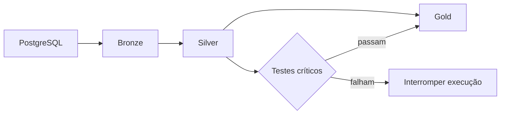

# Fundação analítica Snowflake

Esta pasta contém a infraestrutura versionada e o projeto analítico que transformam
as 16 tabelas do e-commerce em uma camada Silver source-conformed e uma camada Gold
dimensional de vendas. O Git é a fonte de verdade; mudanças são aplicadas pelo
terminal, não diretamente no Snowsight.

## Entradas

- [Bootstrap](bootstrap/): cria database, schemas, roles, grants e usuário de serviço.
- [Projeto dbt](analytics/): define sources, modelos, contratos, testes e documentação.
- [Runbook](RUNBOOK.md): prepara um clone, executa, valida e diagnostica o pipeline.

## Arquitetura



O runner manual executa a carga Bronze antes de `dbt build`. O dbt resolve a DAG,
constrói Silver antes de Gold e interrompe a execução quando um teste crítico falha.

| Camada | Relação física | Materialização | Responsabilidade |
| --- | --- | --- | --- |
| Bronze | `DATA_LAB.BRONZE` | Tabelas substituídas pelo dlt | Cópia operacional sem `password_hash` |
| Silver | `DATA_LAB.SILVER` | Views dbt | Contratos source-conformed, tipos e UTC |
| Gold | `DATA_LAB.GOLD` | Tables dbt | Fatos, dimensões e medidas de vendas |

## Silver

As 16 views preservam o grão e as chaves naturais da origem:

- `stg_users`
- `stg_addresses`
- `stg_categories`
- `stg_products`
- `stg_product_variants`
- `stg_product_images`
- `stg_inventory`
- `stg_carriers`
- `stg_carts`
- `stg_cart_items`
- `stg_orders`
- `stg_order_items`
- `stg_order_status_history`
- `stg_payments`
- `stg_shipments`
- `stg_inventory_movements`

Timestamps analíticos são normalizados para UTC. A Silver mantém PII operacional
necessária, mas exclui `password_hash`.

## Gold

As cinco tables formam o contrato dimensional de vendas:

- `dim_date`: uma linha por data UTC presente em pedidos.
- `dim_customer`: uma linha por cliente, no estado atual e sem PII direta.
- `dim_product`: uma linha por variante, com produto e categoria direta.
- `fct_orders`: uma linha por pedido, com pagamentos agregados antes do join.
- `fct_order_items`: uma linha por combinação de pedido e variante.

Valores financeiros permanecem separados por moeda. A Gold não expõe nome, e-mail,
telefone, endereço ou `password_hash`.

## Métricas

| Métrica | Definição | Grão |
| --- | --- | --- |
| Receita reconhecida | `sum(fct_orders.recognized_revenue)` | Moeda e período UTC |
| Pedidos pagos | `count(*)` de pedidos com `recognized_revenue > 0` | Moeda e período UTC |
| Ticket médio | Receita reconhecida dividida por pedidos pagos | Moeda e período UTC |
| Unidades vendidas | `sum(fct_order_items.qty)` de pedidos com captura | Período UTC |
| Receita de mercadorias | `sum(fct_order_items.line_total)` de pedidos com captura | Moeda e período UTC |

`recognized_revenue` soma somente pagamentos com status `captured`. Pedidos sem
captura contribuem com zero. Valores `refunded` ficam fora da receita reconhecida e
são expostos separadamente em `fct_orders.refunded_amount`.

## Resultado esperado

Uma execução válida cria ou atualiza 16 views em Silver e cinco tables em Gold, com
todos os testes críticos aprovados. As dimensões usam estado atual (Tipo 1), a data
analítica usa UTC e nenhuma métrica financeira combina moedas.

Sem alteração da origem ou do código, duas execuções consecutivas do runner devem
produzir as mesmas contagens e somas Gold por moeda. Siga a validação e a política de
reexecução do [Runbook](RUNBOOK.md); preserve os dois logs como evidência.

Gere o catálogo e o lineage local depois de configurar o profile:

```powershell
dbt docs generate --project-dir dw\snowflake\analytics --profiles-dir dw\snowflake\analytics
```
